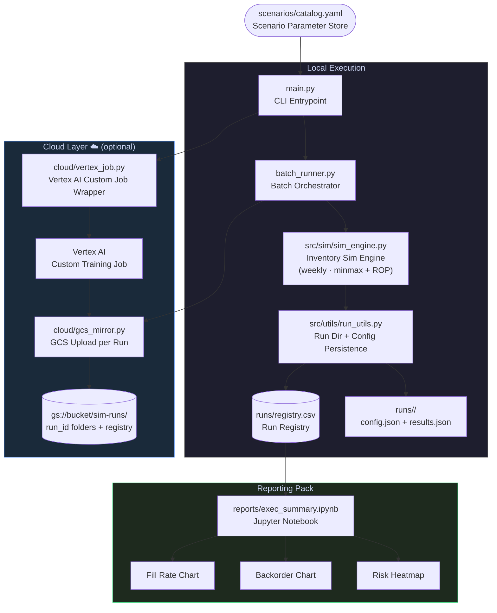

# Scalable Simulation Framework


A production-pattern **supply chain inventory simulation engine** built to demonstrate
scalable data engineering, cloud-ready architecture, and decision-support tooling —
the same patterns used in demand planning, S&OP, and risk analytics at enterprise scale.

---

## What It Does

Simulates weekly inventory behaviour across a configurable SKU portfolio under four
scenario severities — from normal operations to black-swan supply shocks — and produces
an executive-ready reporting pack with fill rate, backorder, and risk KPIs.

| Scenario | Demand Shock | Avg Lead Time | Policy | Represents |
|---|---|---|---|---|
| **Base** | None | 7–14 days | Min-Max | Normal ops |
| **Conservative** | +10%, 6 wks | ~18 days | Min-Max | Mild disruption |
| **Stress** | +35%, 10 wks | ~28 days | Min-Max | Major disruption |
| **BlackSwan** | +75%, 15 wks | ~45 days | ROP | Extreme event |

---

## Architecture



---

## Key Technical Decisions

**Seeded reproducibility** — every run stores its seed in `config.json` so results
are fully deterministic and auditable. Rerun any row in the registry with identical output.

**Policy-agnostic engine** — the sim engine dispatches on `reorder_policy.policy`
(currently `minmax` and `rop`), making it straightforward to add new policies
(e.g. `s_s`, `kanban`) without touching orchestration or reporting code.

**Zero-config cloud** — GCS mirroring and Vertex AI submission are injected via
`gcs_mirror_fn` callback, so the core batch runner has no cloud dependency.
Local runs stay fully offline; cloud is opt-in via a single CLI flag.

**Separation of concerns**

```
src/sim/          ← pure simulation logic (no I/O)
src/utils/        ← filesystem helpers (no sim logic)
batch_runner.py   ← orchestration (no cloud dependency)
cloud/            ← cloud adapters (no sim logic)
reports/          ← reporting (reads registry only)
```

---

## Project Structure

```
scalable-sim-framework/
├── main.py                    # CLI: local runs + Vertex AI submission
├── batch_runner.py            # Orchestrates scenario × seed matrix
├── Dockerfile                 # Container for Vertex AI Custom Jobs
├── PLAYBOOK.md                # Operations guide (run · interpret · guardrails)
│
├── scenarios/
│   └── catalog.yaml           # Scenario definitions (Base/Conservative/Stress/BlackSwan)
│
├── src/
│   ├── sim/
│   │   ├── sim_engine.py      # Weekly inventory simulation core
│   │   └── inventory_types.py # SKUParams, SKUState, SKUResults dataclasses
│   └── utils/
│       └── run_utils.py       # Run directory + config/results persistence
│
├── cloud/
│   ├── gcs_mirror.py          # Per-run GCS upload + registry sync
│   └── vertex_job.py          # Vertex AI Custom Job wrapper + container entrypoint
│
├── reports/
│   ├── exec_summary.ipynb     # Executive summary notebook (auto-loads registry)
│   ├── build_notebook.py      # Regenerates notebook from source
│   └── *.png                  # Pre-rendered charts
│
└── runs/
    └── registry.csv           # Logged output of all batch runs
```

---

## Quickstart

```bash
# Clone
git clone https://github.com/Tmgilliam/scalable-sim-framework.git
cd scalable-sim-framework

# Install
pip install pyyaml

# Run all scenarios (3 seeds each → 12 runs)
python main.py

# Run specific scenarios
python main.py --scenarios Stress BlackSwan --seeds 42 43 44

# Open the report
pip install pandas matplotlib jupyter
jupyter notebook reports/exec_summary.ipynb
```

**With GCS mirroring:**
```bash
pip install google-cloud-storage
python main.py --bucket my-bucket --prefix sim-runs
```

**Submit to Vertex AI:**
```bash
pip install google-cloud-aiplatform
python main.py --vertex \
  --project my-gcp-project \
  --bucket my-bucket \
  --image gcr.io/my-gcp-project/sim-framework:latest
```

---

## Sample Output

```
[1/12] Base         seed=42  | fill_rate=1.0000  backorders=0.0
[2/12] Conservative seed=42  | fill_rate=0.9995  backorders=20.0
[3/12] Stress       seed=42  | fill_rate=0.6749  backorders=13534.0
[4/12] BlackSwan    seed=42  | fill_rate=0.7624  backorders=11277.5

Batch complete. 12 runs logged -> runs/registry.csv
```

---

## Tech Stack

| Layer | Technology |
|---|---|
| Simulation | Python 3.11, dataclasses, seeded `random` |
| Config | YAML (scenario catalog), JSON (per-run config + results) |
| Orchestration | Pure Python batch runner, CSV run registry |
| Cloud storage | Google Cloud Storage (`google-cloud-storage`) |
| Cloud compute | Vertex AI Custom Jobs (`google-cloud-aiplatform`) |
| Containerisation | Docker |
| Reporting | Jupyter, pandas, matplotlib |

---

## Roadmap

- [ ] Stochastic demand (configurable demand distributions per SKU)
- [ ] Multi-echelon support (warehouse → store tier)
- [ ] BigQuery registry sink (replace CSV for large-scale runs)
- [ ] Looker Studio dashboard template
- [ ] GitHub Actions CI: run Base scenario on every push

---

## Operations Guide

See **[PLAYBOOK.md](PLAYBOOK.md)** for the full run guide, output key, and guardrails.

---

*Built as part of a portfolio of production-pattern data & cloud engineering projects.*
