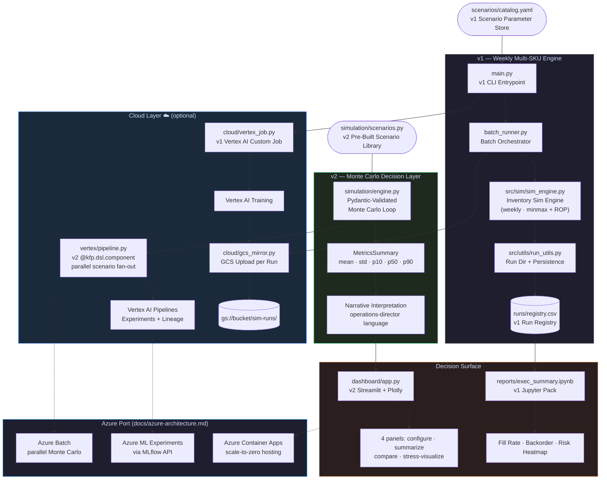

# Scalable Simulation Framework


A production-pattern **supply chain inventory simulation engine** built to demonstrate
scalable data engineering, cloud-ready architecture, and decision-support tooling —
the same patterns used in demand planning, S&OP, and risk analytics at enterprise scale.

The framework ships in **two layers**:

- **v1 — Weekly multi-SKU batch engine** with policy-agnostic dispatch (min/max + ROP),
  YAML scenario catalog, GCS mirroring, Vertex AI Custom Job submission, and a Jupyter
  reporting pack. Runs `python main.py`. The original recruiter-facing portfolio piece.
- **v2 — Pydantic-validated daily Monte Carlo engine** with p10 / p50 / p90 risk
  aggregation, a Vertex AI Pipelines component (`@kfp.dsl.component`), a Streamlit
  operations dashboard, and a documented Azure architecture extension. Runs
  `python -m simulation.scenarios --scenario baseline`.

Both layers share the same `src/sim/` weekly inventory engine and live side by side in
this repo. Pick the layer that matches the decision you are making.

---

## What It Does

Simulates inventory behaviour across a configurable SKU portfolio under multiple
scenario severities — from normal operations to black-swan supply shocks — and produces
both an executive-ready reporting pack (v1) and a Monte Carlo risk distribution (v2)
covering fill rate, backorders, stockout days, and average inventory.

### v1 scenario catalog (`scenarios/catalog.yaml`)

| Scenario | Demand Shock | Avg Lead Time | Policy | Represents |
|---|---|---|---|---|
| **Base** | None | 7–14 days | Min-Max | Normal ops |
| **Conservative** | +10%, 6 wks | ~18 days | Min-Max | Mild disruption |
| **Stress** | +35%, 10 wks | ~28 days | Min-Max | Major disruption |
| **BlackSwan** | +75%, 15 wks | ~45 days | ROP | Extreme event |

### v2 scenario library (`simulation/scenarios.py`)

| Scenario | What it models |
|---|---|
| **baseline** | Steady-state normal operations |
| **demand_shock** | 2x demand spike for a configurable window (launch event, viral demand) |
| **lead_time_crisis** | 2x lead time for a configurable window (port closure, sole-source disruption) |
| **combined_stress** | Demand shock + lead time increase together (the compound case) |
| **service_level_sensitivity** | Sweep target from 85% → 99% to quantify the cost / service tradeoff |

---

## Architecture



---

## Key Technical Decisions

**Seeded reproducibility** — every v1 run stores its seed in `config.json` so results
are fully deterministic and auditable. Every v2 Monte Carlo run derives its per-replication
RNG from a master seed for the same reason. Rerun any row in the registry with identical output.

**Policy-agnostic v1 engine** — `src/sim/sim_engine.py` dispatches on
`reorder_policy.policy` (currently `minmax` and `rop`), making it straightforward to add
new policies (e.g. `s_s`, `kanban`) without touching orchestration or reporting code.

**Pydantic-validated v2 config** — `simulation/config.py` rejects malformed scenarios at
construction time, including cross-field validators (reorder_qty must plausibly cover
expected lead-time demand). Operations leadership runs scenarios through a UI; the
config layer fails loud and early rather than three minutes into a 1,000-run sweep.

**Zero-config cloud** — GCS mirroring and Vertex AI submission are injected via
`gcs_mirror_fn` callback (v1) and a `run_component_locally(...)` fallback (v2), so the
core simulation has no required cloud dependency. Local runs stay fully offline;
cloud is opt-in.

**Compute portability by design** — the v2 simulation core and config contract are
cloud-agnostic. `vertex/pipeline.py` (KFP) and the documented Azure ML port share the
same component contract — only the orchestration wrapper changes per cloud.
See `docs/azure-architecture.md` for the AZ-305-aligned multi-cloud architecture story.

**Separation of concerns**

```
src/sim/          ← pure v1 simulation logic (no I/O)
src/utils/        ← filesystem helpers (no sim logic)
batch_runner.py   ← v1 orchestration (no cloud dependency)
cloud/            ← v1 cloud adapters (no sim logic)
reports/          ← v1 reporting (reads registry only)
simulation/       ← v2 Monte Carlo engine + config + scenarios
vertex/           ← v2 KFP component (with local fallback)
dashboard/        ← v2 Streamlit dashboard
docs/             ← multi-cloud architecture docs
portfolio/        ← case study, interview talk track, resume bullets
```

---

## Project Structure

```
scalable-sim-framework/
│
├── v1 surface ───────────────────────────────────────────────
├── main.py                    # CLI: local runs + Vertex AI submission
├── batch_runner.py            # Orchestrates scenario × seed matrix
├── Dockerfile                 # Container for Vertex AI Custom Jobs
├── PLAYBOOK.md                # v1 operations guide
│
├── scenarios/
│   └── catalog.yaml           # v1 scenario definitions
│
├── cloud/
│   ├── gcs_mirror.py          # Per-run GCS upload + registry sync
│   └── vertex_job.py          # v1 Vertex AI Custom Job wrapper
│
├── reports/
│   ├── exec_summary.ipynb     # v1 executive summary notebook
│   ├── build_notebook.py      # Regenerates notebook from source
│   └── *.png                  # Pre-rendered charts
│
├── runs/
│   ├── registry.csv           # v1 run registry
│   └── 2026*_<scenario>_<hash>/  # v2 scenario-aware run dirs
│
├── v2 surface ───────────────────────────────────────────────
├── simulation/
│   ├── config.py              # Pydantic ScenarioConfig + validators
│   ├── engine.py              # Daily Monte Carlo loop + aggregation
│   └── scenarios.py           # Pre-built scenario library + narratives
│
├── vertex/
│   ├── pipeline.py            # @kfp.dsl.component + local fallback
│   └── README.md              # Vertex AI integration docs
│
├── dashboard/
│   └── app.py                 # Streamlit + Plotly operations dashboard
│
├── docs/
│   └── azure-architecture.md  # Azure Batch + AML + Container Apps port
│
├── portfolio/
│   ├── case-study.md          # Business framing for recruiters
│   ├── interview-talk-track.md  # 60s pitch + deep-dive + Q&A
│   └── resume-bullets.md      # VP/SA + Cloud/ML Engineer bullets
│
├── shared ───────────────────────────────────────────────────
├── src/
│   ├── sim/
│   │   ├── sim_engine.py        # Weekly inventory engine (v1 + v2 share)
│   │   ├── inventory_types.py   # SKUParams / SKUState / SKUResults
│   │   ├── data_loader.py       # CSV → SKUParams
│   │   ├── scenario.py          # YAML catalog + deep-merge inheritance
│   │   ├── batch_runner.py      # Module-style batch runner
│   │   ├── run_simulation.py    # v2-style CLI entry (scenario + cfg-hash)
│   │   └── run_scenario.py      # Alternate v2-style CLI entry
│   └── utils/
│       ├── config.py            # ScenarioConfig dataclass + stable_hash
│       └── run_utils.py         # BOTH make_run_dir signatures, side by side
│
├── configs/
│   ├── data/sample_skus.csv     # 3-SKU sample dataset
│   └── scenarios/catalog.yaml   # v2-flavored catalog (richer overrides)
│
├── registry/
│   └── run_registry.csv         # v2 batch registry
│
├── tests/
│   ├── smoke_test.py            # End-to-end v1 CLI
│   ├── validate_outputs.py      # Regression guard
│   └── test_monte_carlo.py      # 13 v2 engine + Pydantic tests
│
├── status.md                    # Audit + merge log
├── requirements.txt             # Pinned dependency surface (v1 + v2)
└── .github/workflows/ci.yml     # flake8 + pytest on every PR
```

---

## Quickstart

```bash
# Clone
git clone https://github.com/Tmgilliam/scalable-sim-framework.git
cd scalable-sim-framework

# Install (covers BOTH layers)
pip install -r requirements.txt
```

### v1 — weekly batch engine

```bash
# Run all v1 scenarios (3 seeds each → 12 runs)
python main.py

# Run specific scenarios
python main.py --scenarios Stress BlackSwan --seeds 42 43 44

# Open the v1 report
jupyter notebook reports/exec_summary.ipynb
```

**With GCS mirroring:**
```bash
pip install google-cloud-storage
python main.py --bucket my-bucket --prefix sim-runs
```

**Submit to Vertex AI Custom Jobs:**
```bash
pip install google-cloud-aiplatform
python main.py --vertex \
  --project my-gcp-project \
  --bucket my-bucket \
  --image gcr.io/my-gcp-project/sim-framework:latest
```

### v2 — Monte Carlo decision layer

```bash
# Run a single pre-built scenario
python -m simulation.scenarios --scenario baseline --num-runs 200 --simulation-days 180

# Run every pre-built scenario in turn
for s in baseline demand_shock lead_time_crisis combined_stress service_level_sensitivity; do
  python -m simulation.scenarios --scenario $s
done

# Run the Vertex AI component locally (no GCP project needed)
python -m vertex.pipeline --scenario combined_stress --num-runs 200

# Launch the operations dashboard
streamlit run dashboard/app.py
```

### Tests

```bash
pytest -v   # 15 tests: smoke + regression guard + 13 Monte Carlo
```

---

## Sample Output

v1 batch run:
```
[1/12] Base         seed=42  | fill_rate=1.0000  backorders=0.0
[2/12] Conservative seed=42  | fill_rate=0.9995  backorders=20.0
[3/12] Stress       seed=42  | fill_rate=0.6749  backorders=13534.0
[4/12] BlackSwan    seed=42  | fill_rate=0.7624  backorders=11277.5

Batch complete. 12 runs logged -> runs/registry.csv
```

v2 Monte Carlo scenario (operations-director narrative):
```
Scenario 'combined_stress' (200 Monte Carlo runs over 180 days):
  - Median fill rate is 79.1%; 10% of futures fall below 76.9%.
  - You would expect about 20 stockout days half the time,
    and as many as 25 in the worst 10% of outcomes.
  - The policy holds a median average inventory of 579 units.
  - Under these assumptions the policy falls short of the 95%
    service-level target (median 83.3%).
```

---

## Tech Stack

| Layer | Technology |
|---|---|
| v1 Simulation | Python 3.11, dataclasses, seeded `random` |
| v2 Simulation | Python 3.11, **NumPy**, **Pydantic v2** |
| Config | YAML (scenario catalog), JSON (per-run), Pydantic schema |
| Orchestration (v1) | Pure Python batch runner, CSV run registry |
| Orchestration (v2) | **`kfp` Vertex AI Pipelines component** with local fallback |
| Cloud storage | Google Cloud Storage; Azure Blob Storage (documented port) |
| Cloud compute | Vertex AI Custom Jobs + Pipelines; Azure Batch + Azure ML (documented port) |
| Containerisation | Docker |
| v1 Reporting | Jupyter, pandas, matplotlib |
| v2 Dashboard | **Streamlit**, **Plotly** |
| CI | GitHub Actions: flake8 + pytest (smoke + regression + Monte Carlo) |

---

## Roadmap

- [x] **Stochastic demand** (configurable demand distributions per SKU) — implemented in v2
- [x] **GitHub Actions CI** — implemented (flake8 + pytest on every PR)
- [x] **Risk distribution outputs** (p10/p50/p90 for every KPI) — implemented in v2
- [x] **Operations-leadership dashboard** — implemented in v2 (Streamlit + Plotly)
- [x] **Multi-cloud architecture story** — implemented (Vertex AI + documented Azure port)
- [ ] Multi-echelon support (warehouse → store tier)
- [ ] BigQuery / Synapse registry sink (replace CSV for large-scale runs)
- [ ] Looker Studio / Power BI dashboard template
- [ ] Live Azure ML pipeline implementation alongside the Vertex AI one

---

## Operations Guide

- v1 — see **[PLAYBOOK.md](PLAYBOOK.md)** for the full run guide, output key, and guardrails.
- v2 — see **[portfolio/case-study.md](portfolio/case-study.md)** for the business
  framing, **[portfolio/interview-talk-track.md](portfolio/interview-talk-track.md)** for
  the 60-second pitch and architecture deep-dive, and
  **[docs/azure-architecture.md](docs/azure-architecture.md)** for the multi-cloud
  enterprise port.

---

*Built as part of a portfolio of production-pattern data & cloud engineering projects.*
